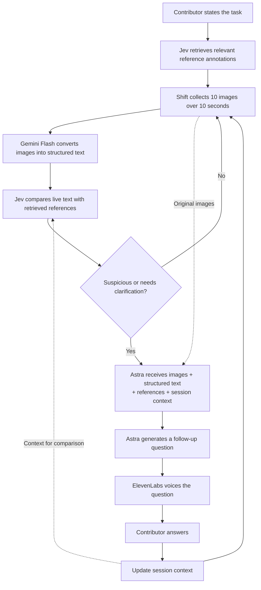

# AI Physical Hack

```mermaid
flowchart TD
    A["Contributor states the task"] --> B["Jev retrieves relevant reference annotations"]
    B --> C["Shift collects 10 images over 10 seconds"]
    C --> D["Gemini Flash converts images into structured text"]
    D --> E["Jev compares live text with retrieved references"]
    E --> F{"Suspicious or needs clarification?"}

    F -->|No| C
    F -->|Yes| G["Astra receives images + structured text<br/>+ references + session context"]
    C -.->|Original images| G
    G --> H["Astra generates a follow-up question"]
    H --> V["ElevenLabs voices the question"]
    V --> I["Contributor answers"]
    I --> J["Update session context"]
    J --> C
    J -.->|Context for comparison| E
```
